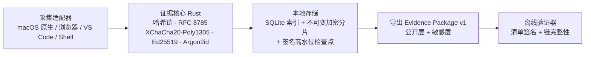

# 学术研究过程诚信记录仪

一个本地优先、主动自我报告式的研究过程记录工具。它将研究软件活动、文件版本、研究条目、AI 使用和终稿锚点组织为不可伪造的可验证证据包。

> 本工具提供不可伪造的过程佐证，但不证明原创性、作者身份或学术诚信。

## 开发

```bash
npm install
source "$HOME/.cargo/env"
npm run dev
npm test
```

运行 Tauri 桌面容器：

```bash
npm run desktop
```

证据验证器：

```bash
cargo run -p evidence-verifier -- path/to/package.evidence.zip --password 'review-password'
```

## 仓库结构

- `crates/evidence-core` — 规范化、哈希链、加密、签名、导出。
- 每个证据包包含一个不含研究内容的外部时间锚定目标；默认完全离线，研究者可在导出后自愿用 OpenTimestamps 对其摘要进行 Bitcoin 时间见证。
- `crates/capture-adapters` — 平台能力探测与采集适配器接口。
- `apps/desktop` — Tauri 2 + React 桌面端。
- `extensions/browser` — Chrome/Edge/Firefox WebExtension。
- `extensions/vscode` — VS Code 语义事件扩展。
- `integrations/shell` — 可选的 zsh/bash 命令事件集成。
- `spec/evidence-package-v1.md` — 公开证据包规范。
- `tools/verifier` — 离线验证器。

## 系统架构



整个链路都在本机完成，没有任何遥测离开设备；敏感内容默认加密，能力边界诚实披露。

## 论文 / Paper

本项目配套一篇英文论文，提出「不可伪造性（unforgeability）」作为与可重复性并列的科学诚信新范式：

> Unforgeable Process Evidence: A New Paradigm of Scientific Integrity
> Complementing Reproducibility

- 源文件与编译产物：`paper/main.tex`、`paper/refs.bib`、`paper/main.pdf`
- 核心论点：可重复性验证「*结果能否被重建*」（what），不可伪造的过程证据验证「*结果是如何得出的*」（how）；二者是相互独立的范式，互补而非替代。
- 非主张（non-claim）：证据包只证明过程完整性与设备签名（在既定密码学假设下），不认证身份、作者资格、原创性或学术诚信。

浏览器、VS Code 与 Shell 使用彼此隔离的项目专用本机令牌；浏览器在读取
字段内容前确认当前域名仍获选，VS Code/Shell 只接受所选研究目录中的路径。
桌面设置页可把当前研究根目录内的真实文件或目录加入排除表；排除项会停止
相应文件观察，并把范围变化本身追加到证据链。
同步目录只备份加密不可变分片、内容对象和签名检查点，不包含密钥或可变
SQLite，因此不能单独作为跨设备迁移包。

OpenTimestamps 的可选使用方式与证据边界见
[`docs/OPENTIMESTAMPS.md`](docs/OPENTIMESTAMPS.md)。

## 平台声明

macOS 的前台窗口和窗口截图路径需要辅助功能、System Events 自动化和屏幕录制中的相应权限；v1 原生适配器不申请输入监控，也不采集原始键入文本。Windows 和 Linux 当前仅会诚实检测会话/接口，原生前台窗口、截图、全局输入仍标记为 `Unavailable`，不会用权限需求伪装未实现能力。具体边界见 [`docs/PLATFORM_CAPABILITIES.md`](docs/PLATFORM_CAPABILITIES.md)。

桌面端注册 `CommandOrControl+Shift+Alt+R` 作为全局暂停/恢复快捷键。托盘菜单也提供暂停/恢复与隐私模式；每次状态变化都会写入追加式记录和可见缺口。若快捷键已被其他软件占用，应用仍可启动，托盘与窗口控制继续可用。
项目截图间隔可在设置页调整为 10–3600 秒；变更前后的值会写入证据链，并在导出材料中按项目录制政策披露。
